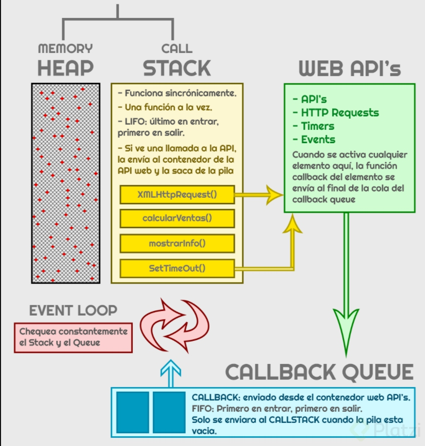

## Asincronismo
La parte importatnte es que los lengusjes de programacion son sicronos esto quiere
decir que los lenguajes se ejcutaran linea por linea de la misma manera JavaScrip es
un lenguaje sincrono por defecto que se ejecuta en un solo hilo.

"JavaScript es sincrono y no bloqueante, con un bucle de eventos (Concurrencia), implementado con un unico hilo para sus interfaces de I/O"

Algunas conceptos de JavaScript es 

+ Single-thread (Un solo hilo) => Aun con múltiplis procesadores solo se ejecuta en un solo hilo
+ bloqueante => Una tarea no devuelve el control hasta que sea terminada 
+ No bloqueante => Una tarea se devuelve inmediatamente con independia del resultado
+ Sincrono => La tareas se ejecutan de forma secuencia se debe esperar a que se completen para continuar con la siguiente tarea
+ Asincromo => la tareas se pueden ejecuatr mas tarde y las respuestas pueden llegar en diferidos
+ Concurrencia => Utliza un modelo basado en eventos "Event-loop"
+ Event-loop => Es un bucle de eventos es un patron de diseño que espera y distribuye eventos

### Formas de manejar la asincronía en JavaScript:

+ Callbacks => Una función que se pasa como argumento de otra función y que será invocada.
+ Promesas => (implementado en ES6) Una promesa es una función no-bloqueante y asíncrona la cual + puede retornar un valor ahora, en el futuro o nunca.
+ Async / Await => (implementado en ES2017) Permite estructurar una función asincrónica sin bloqueo de una manera similar a una función sincrónica ordinaria.

## Event-loop

Es un patron de diseño que espera y distribuye eventos o mensajes en un programa algunas carateristica son.

+ Memory Heap => Los objetos son asignados a un monticulo (espacio grande en memoria).

+ Call Stack => Apila de forma organizada las instrucciones de nuestro programa. LIFO. Last-in, First-out.

+ Task Queue => Cola de tareas, se maneja la concurrencia, se agregan las tareas que ya están listas para pasar al Stack. El Stack debe estar vacío.

+ MicroTask Queue => Las promesas tienen otra forma de ejecutarse y una prioridad superior.

+ Web APIs => Javascript del lado del cliente.

Event Loop. Tarea asignada para mover del Task Queue al Stack, solo si Stack esta vacio